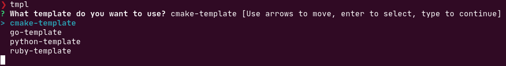

# tmpl

`tmpl` is an over-engineered project generation tool I wrote for myself. It can
generate nested files (optionally with text) and directories. You can also set
variables in the template file and `tmpl` can fill it in, using Go's template
semantics. `tmpl` can also generate an example template given a name like this:

``` shell
tmpl gen <template-name>
```

There's also a handy sub-command that can open the template in an editor,
without having to go to the template directory manually. It requires an `EDITOR`
variable be set in your environment. 

``` shell
tmpl ed <template-name>
```

You can get a list of all the templates with the `ls` command:

``` shell
tmpl ls
```

But if you're in a hurry to edit or generate a template, and you don't want to
look up the templates with the `ls` command, you can just call `tmpl` or `tmpl
ed` without any arguments. It will interactively prompt you with a list of
suggestions which is a list of all the template files in the template directory.

Here's an example:


All templates are stored in `$HOME/.tmpl/templates/`. I might add some
configuration to change this, or whatever else that's configurable in the
future, but I'm probably the only person who will ever use this. If you want
some extra functionality, please make an issue or fork and make a pull request
:).


There are two keys in every template file:
1. `variables`
2. `template`

`template` is the only required one. Inside `template` there are two keys: 
1. `files`
2. `dirs`

`files` is a list of file specs, each spec requires a `name` key and optionally
a `content` key. The `content` key is a multi-line string, `tmpl` will write the
string to the file if `content` is defined.

`dirs` is a list of directory specs, and actually looks like the `template` key.
Each `dirs` specs can have the following keys:
1. `files`
2. `dirs`

The same rules apply to `files` and `dirs` are just nested `dirs` specs.

`variables` contains nested keys where the key is the name of the variable and
the value is the text that is written in the template. For example, if you had
the following variables:

``` yaml
variables:
  project: MyProjectName
```

and you were generating a README and you want to use your project variable in
it:

``` yaml
template:
  files:
    - name: README.md
      content: |
        ...
        The name of my project is {{ .project }}
        ...
```

When the file is generated the line of text would read `The name of my project
is MyProjectName`. If you want to get fancier, look up Go's `text/template`
documentation to see what you can do with templates.

This is an example template file generated with the `gen` command:

``` yaml
# You can specify template variables which can written to file contents.
# It uses Go style template syntax.
variables:
  project: test-project

# An example cmake project
template:
  files:
    - name: CMakeLists.txt
      content: |
        cmake_minimum_required(VERSION 3.1...3.21)

        # Fill in the project variable defined in variables
        project({{ .project }} VERSION 1.0 LANGUAGES CXX)

        # Find packages go here.

        # You should usually split this into folders, but this is a simple example

        # This is a "default" library, and will match the *** variable setting.
        # Other common choices are STATIC, SHARED, and MODULE
        # Including header files here helps IDEs but is not required.
        # Output libname matches target name, with the usual extensions on your system
        add_library(MyLibExample simple_lib.cpp simple_lib.hpp)

        # Link each target with other targets or add options, etc.

        # Adding something we can run - Output name matches target name
        add_executable(MyExample simple_example.cpp)

        # Make sure you link your targets with this command. It can also link libraries and
        # even flags, so linking a target that does not exist will not give a configure-time error.
        target_link_libraries(MyExample PRIVATE MyLibExample)

  # Here's a directory containing some C code.
  dirs:
    - name: src
      files:
        - name: main.c
          content: |
            #include <stdio.h>

            int main() {
                printf("Hello, world!\n");
                return 0;
            }
```
